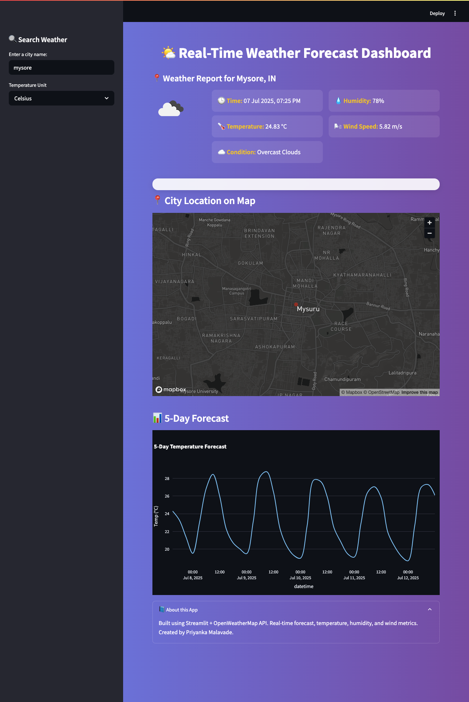

# 🌤️ Real-Time Weather Dashboard using Streamlit



## 📌 Overview

This **Real-Time Weather Dashboard** is a responsive and interactive web app built using **Streamlit** and the **OpenWeatherMap API**. It allows users to:

- Check real-time weather conditions
- View 5-day temperature forecasts
- See the city location on a map
- Switch between Celsius and Fahrenheit

Built with a clean UI and CSS enhancements, this dashboard offers a smooth user experience for exploring weather data from any city across the globe.

---

## 🚀 Features

- 🌍 IP-based default city detection
- 🔍 City-wise real-time weather info
- 🌡️ Temperature, humidity, and wind speed
- 📈 5-day forecast visualization using Plotly
- 📌 City location on interactive map
- 🎨 Custom CSS for beautiful UI
- 📱 Responsive layout (column-based)

---

## 🛠️ Tech Stack

| Tool          | Purpose                            |
|---------------|------------------------------------|
| Streamlit     | Frontend app and dashboard         |
| OpenWeatherMap API | Weather and forecast data        |
| Python        | Core logic and data processing     |
| Plotly        | Forecast chart visualization       |
| Pandas        | Data manipulation                  |
| CSS (via markdown) | UI design and layout              |

---

## ⚙️ How to Run This Project Locally

1. **Clone the repository**:
   ```bash
   git clone https://github.com/your-username/weather-dashboard.git
   cd weather-dashboard

## ⚙️ How to Run This Project Locally

### ✅ Install Dependencies

```bash
pip install streamlit pandas plotly requests
streamlit run weather_dashboard.py
```
## 🔐 API Key Setup

This app uses the **OpenWeatherMap API**.

1. 👉 Sign up at [https://openweathermap.org/api](https://openweathermap.org/api)
2. 🔑 Copy your API key
3. 📝 Replace the placeholder API key in `weather_dashboard.py`:

```python
# In weather_dashboard.py
API_KEY = "your_api_key_here"
```
##  🙌 Credits

- 👩‍💻 Developed by **Priyanka Malavade**  
- 🌐 Weather data powered by [OpenWeatherMap](https://openweathermap.org/)  
- 🎨 UI inspired by modern weather and climate applications  

---

Let me know if you'd like me to:

- Format this in a downloadable file  
- Add badges (e.g., Streamlit badge, MIT license)  
- Generate a `requirements.txt` file  
- Help write a GitHub repo name or deploy it online for free

